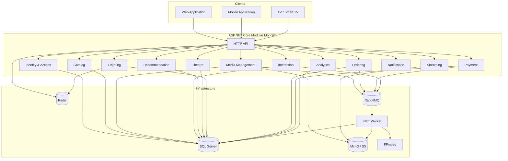
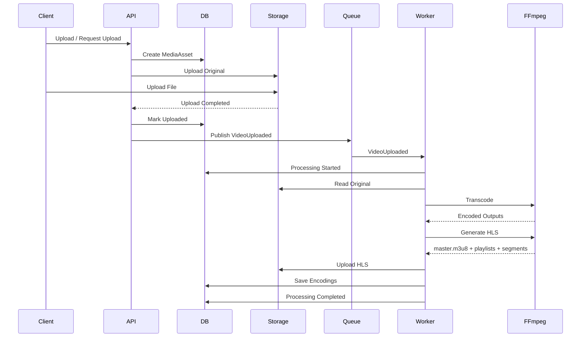
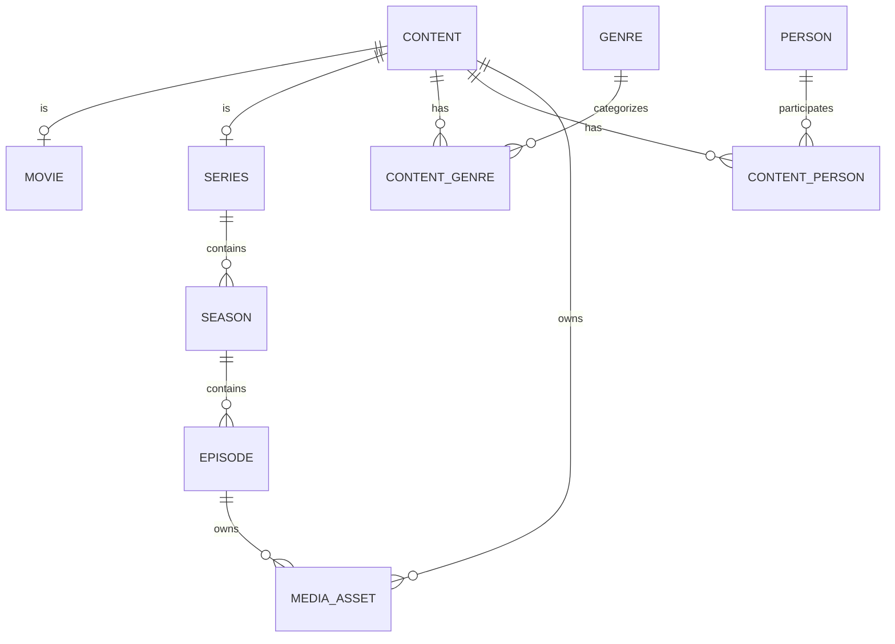
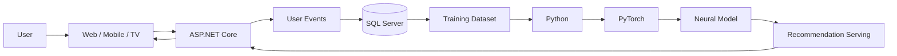
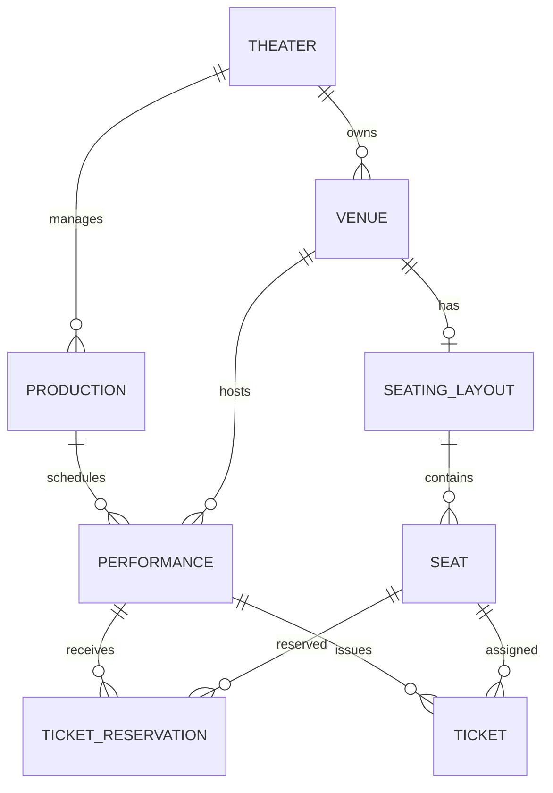
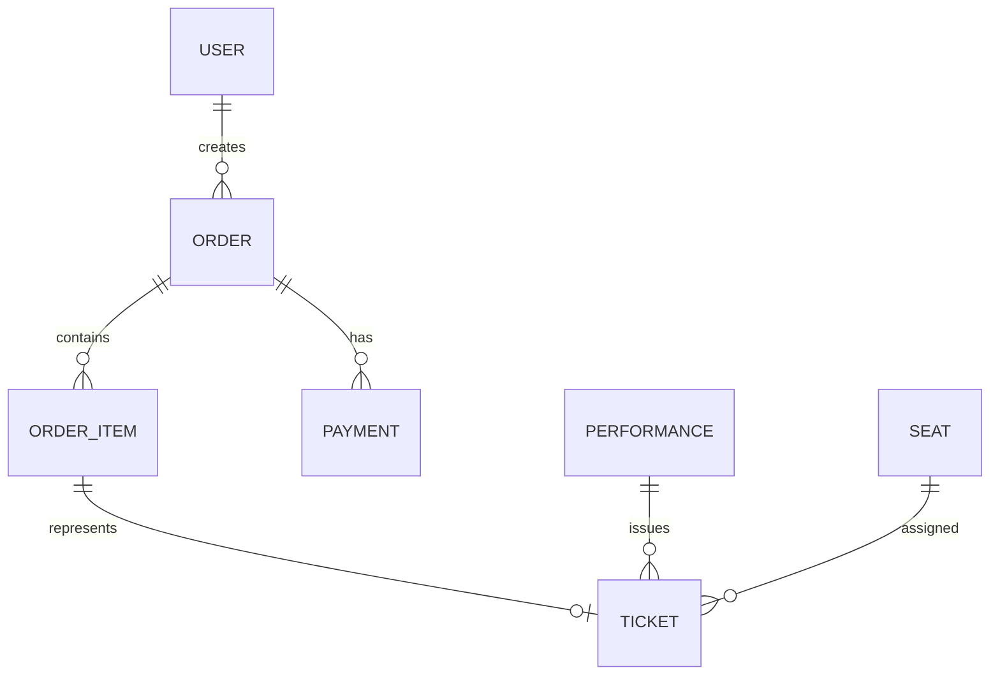
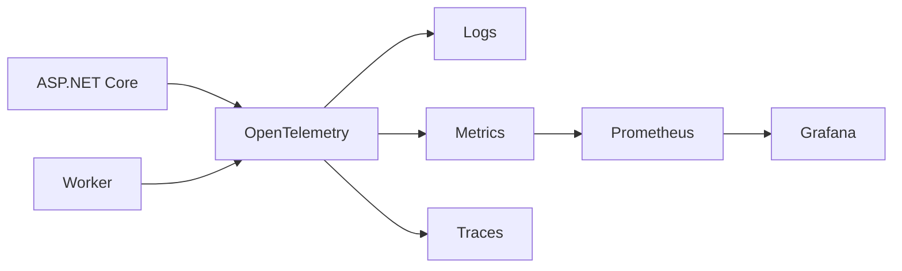
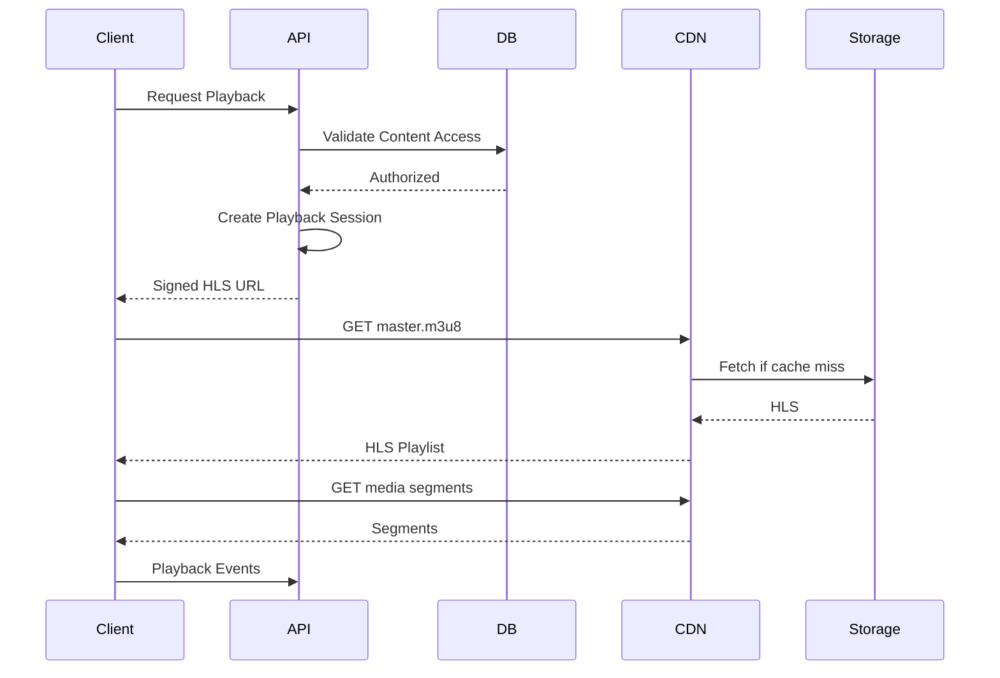
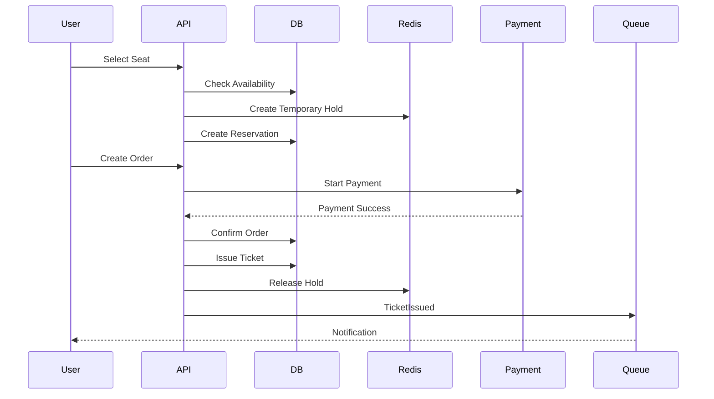

# VOD + Theater Entertainment Platform
## Architecture, Domain Design, Database, Phases & Infrastructure

> **Document status:** Architecture & System Design — Phase 1 Foundation  
> **Architecture style:** Modular Monolith  
> **Backend:** ASP.NET Core / C#  
> **Database:** SQL Server  
> **Object Storage:** MinIO / S3-compatible  
> **Streaming:** HLS  
> **Recommendation Training:** Python + PyTorch

---

# 1. Project Vision

این پروژه یک پلتفرم Entertainment است که دو Domain اصلی را در یک محصول واحد ترکیب می‌کند:

1. **VOD / Video Streaming**
2. **Theater / Theater Ticketing**

سیستم از ابتدا به صورت **MVP طراحی نمی‌شود**. فاز اول باید Domain و Architecture را به شکل کامل و قابل توسعه تعریف کند؛ پیاده‌سازی قابلیت‌ها در فازهای مختلف انجام می‌شود.

هدف معماری:

- Modular Monolith
- مرزبندی واضح Domainها
- قابلیت Scale شدن بخش‌های سنگین
- پردازش Async برای Media
- HLS Adaptive Streaming
- جمع‌آوری کامل داده رفتاری برای Recommendation
- پشتیبانی از Neural Recommendation در آینده
- Ticket Reservation با جلوگیری از Double Booking
- Payment و Order قابل توسعه
- Web / Mobile / TV Client Support
- Observability و Audit از ابتدا

---

# 2. Architectural Principles

اصول اصلی:

- **Modular Monolith over Microservices**
- Domain Isolation
- Database as transactional source of truth
- Object Storage for media, not SQL Server
- Async processing for expensive operations
- Event-driven internal communication where appropriate
- Idempotent operations
- Explicit transaction boundaries
- Optimistic/Pessimistic concurrency where required
- Observable by default
- Security by default
- Recommendation data collection from day one
- Avoid premature distributed architecture

---

# 3. High-Level Architecture



---

# 4. Why Modular Monolith?

این پروژه فعلاً Microservice نیست.

ساختار منطقی:

```text
One Application
    |
    +-- Identity Module
    +-- Catalog Module
    +-- Media Module
    +-- Theater Module
    +-- Ticketing Module
    +-- Payment Module
    +-- ...
```

اما Moduleها باید Boundary مشخص داشته باشند.

### مزایا

- توسعه سریع‌تر
- Debug ساده‌تر
- Transaction ساده‌تر
- Deployment ساده‌تر
- هزینه زیرساخت کمتر
- عدم نیاز به Distributed Transaction
- عدم نیاز به Service Discovery
- عدم نیاز به Kubernetes در فاز اول
- امکان استخراج Moduleهای سنگین در آینده

### هدف

اگر روزی Media به سرویس مستقل تبدیل شد:

```text
Monolith
  |
  +-- Media
```

به:

```text
Media Service
```

تبدیل شود بدون اینکه کل Domain دوباره طراحی شود.

---

# 5. Backend Technology Stack

| Component | Technology |
|---|---|
| Backend | ASP.NET Core |
| Language | C# |
| Architecture | Modular Monolith |
| API | REST API |
| Database | SQL Server |
| ORM | EF Core |
| Query Layer | Dapper |
| Cache | Redis |
| Messaging | RabbitMQ |
| Object Storage | MinIO / S3 |
| Video Processing | FFmpeg |
| Background Processing | .NET Worker Service |
| Scheduled Jobs | Hangfire / Quartz where appropriate |
| ML | Python + PyTorch |
| Streaming | HLS |
| Reverse Proxy | Nginx |
| Containers | Docker |
| Observability | OpenTelemetry |
| Metrics | Prometheus |
| Dashboards | Grafana |
| Logging | Serilog |

---

# 6. Why ASP.NET Core?

ASP.NET Core انتخاب اصلی Backend است چون سیستم فقط یک CRUD API نیست.

Domain شامل:

- Authentication
- Authorization
- RBAC
- Catalog
- Media
- Streaming
- Payment
- Ticketing
- Reservation
- Concurrency
- Analytics
- Recommendation Events

است.

ASP.NET Core برای:

- Transactional workloads
- High-performance APIs
- Background processing
- Authentication/Authorization
- Dependency Injection
- Logging
- Observability
- Containerization

مناسب است.

همچنین C# و .NET اجازه می‌دهند Domainهای مختلف در یک Solution با Boundaryهای واضح پیاده‌سازی شوند.

---

# 7. Why SQL Server?

داده‌های اصلی سیستم relational هستند.

مثلاً:

```text
User
  -> Role
  -> Order
      -> Payment
      -> Ticket
          -> Performance
              -> Venue
                  -> Seat
```

و:

```text
Content
  -> Episode
  -> Person
  -> Genre
  -> Media
```

SQL Server برای:

- ACID Transactions
- Foreign Keys
- Unique Constraints
- Indexing
- Concurrency
- Reporting
- Complex Queries

مناسب است.

SQL Server منبع حقیقت داده‌های transactional سیستم است.

---

# 8. EF Core + Dapper

هر دو استفاده می‌شوند.

## EF Core

برای:

- Domain CRUD
- Identity
- Catalog
- Theater
- Ticketing
- Orders
- Payments
- Configuration

## Dapper

برای:

- Analytics
- Reporting
- Recommendation queries
- Aggregations
- Feed queries
- Complex read models

اصل مهم:

> ORM نباید جای طراحی Query را بگیرد.

---

# 9. Redis

Redis برای:

- Cache
- Hot data
- Rate limiting
- Temporary state
- Reservation TTL
- Session-like data
- Distributed locks در موارد کنترل‌شده

استفاده می‌شود.

Redis Source of Truth نیست.

SQL Server Source of Truth است.

---

# 10. RabbitMQ

RabbitMQ برای Async Internal Processing استفاده می‌شود، نه برای تبدیل سیستم به Microservice.

نمونه:

```text
VideoUploaded
     |
     v
RabbitMQ
     |
     +--> Transcoding Worker
     +--> Thumbnail Worker
     +--> Analytics
```

یا:

```text
PaymentSucceeded
     |
     v
RabbitMQ
     |
     +--> Ticket
     +--> Notification
     +--> Analytics
     +--> Recommendation Event
```

---

# 11. Object Storage

فایل‌های بزرگ نباید در SQL Server ذخیره شوند.

MinIO / S3 برای:

- Original videos
- HLS playlists
- HLS segments
- Images
- Posters
- Backdrops
- Trailers
- Subtitles
- Thumbnails

استفاده می‌شود.

SQL فقط Metadata و Storage Key را نگه می‌دارد.

---

# 12. Media Upload Architecture



---

# 13. HLS Pipeline

```text
Original Video
      |
      v
Validation
      |
      v
Transcoding
      |
      +-- 360p
      +-- 480p
      +-- 720p
      +-- 1080p
      +-- 2160p
      |
      v
HLS Packaging
      |
      +-- master.m3u8
      +-- 360p/playlist.m3u8
      +-- 720p/playlist.m3u8
      +-- 1080p/playlist.m3u8
      |
      v
Object Storage
      |
      v
CDN / Streaming Endpoint
```

---

# 14. Media Processing State

```text
Uploaded
   |
Validated
   |
Queued
   |
Processing
   |
Transcoding
   |
Packaging
   |
Thumbnail Generation
   |
Ready
```

Failure:

```text
Processing
    |
    v
Failed
    |
    +-- Retry
    +-- Permanent Failure
```

Entities:

```text
MediaProcessingJob
MediaProcessingStep
MediaProcessingError
```

---

# 15. VOD Domain

## Content Model



Content یک abstraction مشترک برای Movie و Series است.

---

# 16. Main VOD Entities

```text
Content
Movie
Series
Season
Episode

Person
ContentPerson

Genre
ContentGenre

Language
ContentLanguage

Country
ContentCountry

AgeRating
```

Person می‌تواند نقش‌های مختلف داشته باشد:

```text
Actor
Director
Writer
Producer
```

بنابراین Actor را بهتر است به شکل Role روی Person مدل کنیم.

---

# 17. Media Entities

```text
MediaAsset
VideoAsset
VideoEncoding
Subtitle
MediaProcessingJob
MediaProcessingStep
```

نمونه:

```text
VideoAsset
   |
   +-- Encoding 360p
   +-- Encoding 480p
   +-- Encoding 720p
   +-- Encoding 1080p
   +-- Encoding 2160p
   |
   +-- Subtitle fa
   +-- Subtitle en
```

---

# 18. Interaction Domain

```text
Comment
CommentReply
Reaction
Rating
WatchHistory
WatchProgress
Watchlist
Favorite
```

Comment:

```text
Comment
  |
  +-- ParentComment
  |
  +-- User
  |
  +-- Content
```

Reaction:

```text
Like
Dislike
```

Constraint:

```text
UNIQUE(UserId, ContentId)
```

Rating:

```text
UNIQUE(UserId, ContentId)
```

---

# 19. Watch Progress

WatchProgress برای قابلیت:

```text
Continue Watching
Resume Playback
```

استفاده می‌شود.

نمونه:

```text
User
 |
 +-- Episode
       |
       +-- Position
       +-- Duration
       +-- CompletionRate
       +-- Completed
       +-- LastWatchedAt
```

WatchProgress با Event Tracking یکی نیست.

---

# 20. Recommendation Data Architecture

Recommendation باید از Phase 1 طراحی شود.

دو مفهوم داریم:

### Application State

```text
WatchProgress
WatchHistory
Rating
Reaction
Watchlist
```

### Behavioral Events

```text
Play
Pause
Resume
Seek
Stop
Complete
Search
OpenDetail
Click
Like
Dislike
Rating
AddToWatchlist
RemoveFromWatchlist
RecommendationImpression
RecommendationClick
```

---

# 21. UserEvent

نمونه ساختار:

```text
UserEvent
--------------------
Id
UserId
SessionId

EventType

EntityType
EntityId

Timestamp

Duration
Position

DeviceType
Platform

Metadata
```

Eventها باید:

- Append-oriented
- Immutable where possible
- Timestamped
- Idempotency-aware

باشند.

---

# 22. Recommendation Pipeline



---

# 23. Recommendation Features

Potential user features:

```text
Preferred Genres
Preferred Languages
Watch Frequency
Average Watch Duration
Completion Rate
Favorite Actors
Favorite Directors
Rating Distribution
Activity Frequency
```

Content features:

```text
Genres
Actors
Director
Language
Release Year
Duration
Popularity
```

Context:

```text
Device
Platform
Time of Day
Day of Week
```

Behavior:

```text
Watch Duration
Completion Rate
Click
Search
Like
Rating
Watchlist
```

---

# 24. Theater Domain



---

# 25. Theater Entities

```text
Theater
Venue
SeatingLayout
Seat

Production
ProductionPerson
Performance
```

Theater می‌تواند چند Venue داشته باشد.

Venue می‌تواند Layout متفاوت داشته باشد.

Seat باید اطلاعاتی مثل:

```text
Row
Number
Section
Category
Position
Status
```

داشته باشد.

---

# 26. Performance

یک Production می‌تواند چند Performance داشته باشد.

مثلاً:

```text
Production: Macbeth

Performance #1
2026-09-10 20:00

Performance #2
2026-09-11 20:00

Performance #3
2026-09-12 18:00
```

Ticket به Performance متصل است، نه صرفاً Theater.

---

# 27. Ticket Reservation

جریان:

```text
Select Seat
    |
    v
Create Reservation
    |
    v
Temporary Hold
    |
    v
Create Order
    |
    v
Payment
    |
    +---- Success ----> Ticket Issued
    |
    +---- Failure ----> Release Seat
    |
    +---- Timeout ----> Release Seat
```

Reservation باید TTL داشته باشد.

Double Booking باید با Database Constraint و Transaction کنترل شود.

---

# 28. Ticket Status

```text
Reserved
Paid
Used
Cancelled
Expired
Refunded
```

TicketCode می‌تواند برای QR Ticket استفاده شود.

---

# 29. Order & Payment



Order:

```text
Order
OrderItem
Payment
PaymentTransaction
Refund
```

Order باید generic باشد تا در آینده بتواند:

```text
Ticket
Subscription
Rental
Purchase
```

را پشتیبانی کند.

---

# 30. Database ERD — Integrated View

```mermaid
erDiagram

    USER ||--o{ USER_ROLE : has
    ROLE ||--o{ USER_ROLE : assigned
    ROLE ||--o{ ROLE_PERMISSION : has
    PERMISSION ||--o{ ROLE_PERMISSION : grants

    USER ||--o{ CONTENT_REACTION : reacts
    USER ||--o{ RATING : rates
    USER ||--o{ COMMENT : writes
    USER ||--o{ WATCH_PROGRESS : tracks
    USER ||--o{ WATCH_HISTORY : watches
    USER ||--o{ WATCHLIST_ITEM : saves
    USER ||--o{ USER_EVENT : generates

    CONTENT ||--o| MOVIE : type
    CONTENT ||--o| SERIES : type

    SERIES ||--o{ SEASON : contains
    SEASON ||--o{ EPISODE : contains

    CONTENT ||--o{ CONTENT_PERSON : has
    PERSON ||--o{ CONTENT_PERSON : participates

    CONTENT ||--o{ CONTENT_GENRE : categorized
    GENRE ||--o{ CONTENT_GENRE : contains

    CONTENT ||--o{ MEDIA_ASSET : has
    MEDIA_ASSET ||--o{ VIDEO_ENCODING : encoded
    MEDIA_ASSET ||--o{ SUBTITLE : subtitles

    CONTENT ||--o{ COMMENT : receives
    COMMENT ||--o{ COMMENT : replies

    CONTENT ||--o{ CONTENT_REACTION : receives
    CONTENT ||--o{ RATING : receives
    CONTENT ||--o{ WATCH_PROGRESS : watched
    CONTENT ||--o{ WATCH_HISTORY : history
    CONTENT ||--o{ WATCHLIST_ITEM : listed

    THEATER ||--o{ VENUE : owns
    VENUE ||--o| SEATING_LAYOUT : has
    SEATING_LAYOUT ||--o{ SEAT : contains

    THEATER ||--o{ PRODUCTION : manages
    PRODUCTION ||--o{ PERFORMANCE : schedules
    VENUE ||--o{ PERFORMANCE : hosts

    PERFORMANCE ||--o{ TICKET_RESERVATION : reserves
    SEAT ||--o{ TICKET_RESERVATION : held

    USER ||--o{ ORDER : creates
    ORDER ||--o{ ORDER_ITEM : contains
    ORDER ||--o{ PAYMENT : paid_by

    ORDER_ITEM ||--o| TICKET : purchases
    PERFORMANCE ||--o{ TICKET : issues
    SEAT ||--o{ TICKET : assigned
```



---

# 31. Suggested Database Modules

Database schema should follow Module boundaries.

```text
Identity
Catalog
Media
Interaction
Recommendation
Theater
Ticketing
Ordering
Payment
Notification
```

Avoid one giant generic schema.

Example:

```text
Identity.Users
Identity.Roles

Catalog.Contents
Catalog.Movies
Catalog.Series

Media.MediaAssets
Media.VideoEncodings
Media.Subtitles

Theater.Theaters
Theater.Venues
Theater.Seats

Ticketing.Tickets
Ticketing.Reservations

Ordering.Orders
Ordering.OrderItems

Payment.Payments
```

---

# 32. Important Database Constraints

## Identity

```text
Users.Email UNIQUE
Roles.Name UNIQUE
Permissions.Name UNIQUE
UserRoles UNIQUE(UserId, RoleId)
RolePermissions UNIQUE(RoleId, PermissionId)
```

## Interaction

```text
Reaction UNIQUE(UserId, ContentId)
Rating UNIQUE(UserId, ContentId)
```

## Theater

Seat identity must be unique within its seating layout.

## Ticketing

A seat cannot have two active reservations for the same performance.

The database must enforce this as much as possible; application-level checks alone are insufficient.

---

# 33. API Architecture

API should expose domain-oriented endpoints.

Examples:

```text
/api/v1/auth
/api/v1/users
/api/v1/catalog
/api/v1/movies
/api/v1/series
/api/v1/episodes
/api/v1/media
/api/v1/stream
/api/v1/comments
/api/v1/ratings
/api/v1/watchlist
/api/v1/recommendations

/api/v1/theaters
/api/v1/venues
/api/v1/productions
/api/v1/performances
/api/v1/reservations
/api/v1/tickets

/api/v1/orders
/api/v1/payments
```

API versioning باید از ابتدا در نظر گرفته شود.

---

# 34. Authentication & Authorization

Authentication:

```text
Access Token
Refresh Token
```

Authorization:

```text
User
  |
  +-- Roles
       |
       +-- Permissions
```

Permission examples:

```text
catalog.read
catalog.write
media.upload
media.publish
theater.manage
performance.manage
ticket.sell
ticket.validate
order.read
payment.refund
admin.manage
```

---

# 35. Security

از ابتدا باید موارد زیر در نظر گرفته شوند:

- HTTPS
- JWT validation
- Refresh token rotation
- Password hashing
- Rate limiting
- Request validation
- Authorization checks
- File type validation
- File size validation
- Media access authorization
- Signed/private media URLs where needed
- Audit logging
- Secrets خارج از source code
- Secure headers
- CORS policy
- Anti-abuse controls

---

# 36. Observability



Metrics:

```text
HTTP latency
HTTP error rate
DB latency
Queue depth
Processing duration
Transcoding failures
HLS processing time
Active users
Video starts
Completion rate
Ticket reservation failures
Payment failures
```

---

# 37. Audit Log

AuditLog برای عملیات حساس:

```text
User Role Changed
Content Published
Content Deleted
Media Deleted
Ticket Cancelled
Payment Refunded
Reservation Cancelled
Admin Action
```

نمونه:

```text
AuditLog
----------------
Id
UserId
Action
EntityType
EntityId
Timestamp
IpAddress
Metadata
```

---

# 38. Notification

Notification باید مستقل از Business Logic باشد.

Channels:

```text
Push
Email
SMS
In-App
```

Examples:

```text
Payment Successful
Ticket Issued
Performance Reminder
Reservation Expired
Password Reset
New Content
```

Notification از Eventها مصرف می‌کند.

---

# 39. Search

Search از ابتدا Domain جداگانه‌ای نیست، اما باید برای آن Boundary در نظر گرفته شود.

Phase اول می‌تواند SQL-based باشد.

بعداً در صورت نیاز:

```text
Elasticsearch / OpenSearch
```

اضافه می‌شود.

Search باید بتواند:

```text
Movies
Series
Actors
Directors
Theaters
Productions
```

را جستجو کند.

---

# 40. Recommended Solution Structure

```text
src/
│
├── Host/
│   ├── Api/
│   └── Worker/
│
├── Modules/
│   ├── Identity/
│   │   ├── Domain/
│   │   ├── Application/
│   │   ├── Infrastructure/
│   │   └── Contracts/
│   │
│   ├── Catalog/
│   ├── Media/
│   ├── Interaction/
│   ├── Recommendation/
│   ├── Theater/
│   ├── Ticketing/
│   ├── Ordering/
│   ├── Payment/
│   └── Notification/
│
├── BuildingBlocks/
│   ├── Domain/
│   ├── Application/
│   ├── Infrastructure/
│   ├── Persistence/
│   ├── Messaging/
│   ├── Storage/
│   ├── Security/
│   └── Observability/
│
└── Tests/
    ├── Unit/
    ├── Integration/
    └── Architecture/
```

---

# 41. Internal Module Structure

هر Module:

```text
Module
├── Domain
│   ├── Entities
│   ├── ValueObjects
│   ├── Enums
│   ├── Events
│   └── Rules
│
├── Application
│   ├── Commands
│   ├── Queries
│   ├── Handlers
│   ├── DTOs
│   └── Validators
│
├── Infrastructure
│   ├── Persistence
│   ├── ExternalServices
│   └── Implementations
│
└── Contracts
    ├── Requests
    └── Responses
```

CQRS می‌تواند در Read/Writeهای مناسب استفاده شود.

---

# 42. Phase Plan

این پروژه MVP نیست.

Phaseها بر اساس قابلیت‌های قابل توسعه تقسیم شده‌اند، نه بر اساس حذف Domainها.

---

## Phase 1 — Complete Foundation & Domain

هدف:

طراحی و پیاده‌سازی Foundation کامل.

### Identity

- User
- Role
- Permission
- RBAC
- Organization / Theater scope
- Authentication
- Authorization
- Audit

### VOD

- Content
- Movie
- Series
- Season
- Episode
- Person
- Actor/Director/Writer roles
- Genre
- Language
- Country
- Age Rating
- Catalog status

### Media

- MediaAsset
- VideoAsset
- Original upload
- Encoding model
- Subtitle model
- Poster
- Backdrop
- Thumbnail
- Processing Job
- Processing State
- Storage abstraction

### Interaction

- Comment
- Reply
- Like
- Dislike
- Rating
- Watchlist
- Watch Progress
- Watch History

### Recommendation Data

- UserEvent
- Session
- Event types
- Playback events
- Search events
- Recommendation impression
- Recommendation click
- Dataset-ready event structure

### Theater

- Theater
- Venue
- Seating Layout
- Seat
- Production
- Performance
- Cast
- Schedule

### Ticketing

- Reservation
- Ticket
- Ticket state
- QR code model
- Seat locking
- Expiration

### Commerce

- Order
- OrderItem
- Payment
- Transaction
- Refund model

### Platform

- Notification
- Background Jobs
- RabbitMQ
- Redis
- MinIO
- Logging
- Metrics
- Tracing
- Configuration
- Secrets

---

# Phase 2 — VOD Media Pipeline

هدف: Production-grade video processing.

```text
Upload
  ↓
Validation
  ↓
Storage
  ↓
Queue
  ↓
Transcoding
  ↓
HLS
  ↓
Thumbnail
  ↓
Subtitle
  ↓
Ready
```

قابلیت‌ها:

- Resumable upload
- Large file upload
- Multi-quality transcoding
- HLS packaging
- Subtitle processing
- Thumbnail generation
- Processing retry
- Processing monitoring
- CDN integration
- Signed streaming URLs
- Access control

---

# Phase 3 — Theater & Ticketing

قابلیت‌ها:

- Theater management
- Venue management
- Seat layout editor
- Performance scheduling
- Seat selection
- Temporary reservation
- Payment
- Ticket issuing
- QR code
- Ticket validation
- Cancellation
- Refund
- Sales reporting

---

# Phase 4 — Recommendation Engine

داده Phase 1 وارد ML می‌شود.

```text
Raw Events
    ↓
Cleaning
    ↓
Feature Engineering
    ↓
Training Dataset
    ↓
Train / Validation / Test
    ↓
Neural Network
    ↓
Evaluation
    ↓
Model Registry
    ↓
Serving
```

مراحل ML:

- Dataset generation
- Negative sampling
- Feature engineering
- Embeddings
- Neural architecture
- Training
- Evaluation
- Model versioning
- Experiment tracking
- Inference
- Recommendation API

---

# Phase 5 — Scale & Optimization

در صورت نیاز:

- CDN
- Read replicas
- Database optimization
- Distributed caching
- Queue scaling
- Worker scaling
- Search engine
- Recommendation serving optimization
- Media processing nodes
- GPU workers

Microservice extraction فقط در صورت وجود bottleneck واقعی.

---

# 43. Server Architecture

Production environment:

```text
                    Internet
                       |
                       v
                    Nginx
                       |
                       v
               ASP.NET Core API
                       |
        ┌──────────────┼──────────────┐
        |              |              |
        v              v              v
    SQL Server       Redis        RabbitMQ
        |
        |
        v
      Storage
      MinIO
        |
        v
     HLS Media

RabbitMQ
   |
   v
.NET Worker
   |
   v
 FFmpeg
```

---

# 44. Recommended Server Resources

برای شروع Production کوچک تا متوسط:

## Application Server

```text
CPU: 8 vCPU
RAM: 16 GB
Disk: 100+ GB SSD
Network: 1 Gbps
```

برای Worker:

```text
CPU: 8-16 vCPU
RAM: 16-32 GB
Disk: 200+ GB NVMe
```

Transcoding با توجه به تعداد همزمان Jobها باید Scale شود.

---

# 45. Database Server

```text
CPU: 8-16 vCPU
RAM: 32-64 GB
Disk: NVMe SSD
```

برای SQL Server:

- Fast storage
- Separate data/log volumes در production بزرگ‌تر
- Automated backup
- Point-in-time recovery
- Monitoring
- Index maintenance

ضروری است.

---

# 46. Storage Server

Media storage باید جدا از Application Disk باشد.

حداقل:

```text
CPU: 4-8 vCPU
RAM: 8-16 GB
Storage: چند TB
Network: 1-10 Gbps depending on traffic
```

برای VOD واقعی، ظرفیت Storage مهم‌تر از CPU است.

---

# 47. Recommended Environment

## Development

```text
Docker Compose
├── api
├── worker
├── sqlserver
├── redis
├── rabbitmq
├── minio
├── prometheus
└── grafana
```

FFmpeg روی Worker یا image مربوط به Worker نصب می‌شود.

---

# 48. Production Environment

پیشنهاد اولیه:

```text
Reverse Proxy
       |
       +-- API Server
       |
       +-- Worker Server
       |
       +-- Database Server
       |
       +-- Redis
       |
       +-- RabbitMQ
       |
       +-- MinIO / Object Storage
```

Kubernetes برای Phase اول ضروری نیست.

---

# 49. Docker

تمام اجزا container-friendly باشند:

```text
API
Worker
SQL Server
Redis
RabbitMQ
MinIO
Prometheus
Grafana
```

ولی Persistent Data باید روی Persistent Volume قرار گیرد.

---

# 50. Environment Variables

نمونه:

```env
ASPNETCORE_ENVIRONMENT=Production

ConnectionStrings__Default=...

Redis__ConnectionString=...

RabbitMQ__Host=...
RabbitMQ__Port=5672
RabbitMQ__Username=...
RabbitMQ__Password=...

Storage__Endpoint=...
Storage__AccessKey=...
Storage__SecretKey=...
Storage__Bucket=...

Jwt__Issuer=...
Jwt__Audience=...
Jwt__SigningKey=...

Payment__Provider=...
Payment__ApiKey=...

Observability__OtlpEndpoint=...
```

Secretها نباید Commit شوند.

---

# 51. Backup Strategy

حداقل:

```text
SQL Server
├── Full Backup
├── Differential Backup
└── Transaction Log Backup
```

Object Storage:

```text
Versioning
Replication
Backup
Lifecycle Policy
```

Media Storage باید Backup Policy جداگانه داشته باشد.

---

# 52. CDN

در production، HLS بهتر است مستقیماً از Application Server سرو نشود.

Flow:

```text
Client
  |
  v
CDN
  |
  v
Object Storage
```

API فقط:

```text
Authentication
Authorization
Playback Session
Signed URL
```

را کنترل می‌کند.

---

# 53. Playback Architecture



---

# 54. Ticket Purchase Architecture



---

# 55. Recommendation Event Example

مثلاً User یک فیلم را باز می‌کند:

```json
{
  "eventType": "ContentOpened",
  "userId": "...",
  "sessionId": "...",
  "entityType": "Movie",
  "entityId": "...",
  "timestamp": "...",
  "deviceType": "mobile",
  "platform": "android"
}
```

هنگام Playback:

```json
{
  "eventType": "PlaybackProgress",
  "userId": "...",
  "entityType": "Episode",
  "entityId": "...",
  "position": 1532,
  "duration": 2400,
  "completionRate": 0.63,
  "timestamp": "..."
}
```

این داده بعداً برای Training استفاده می‌شود.

---

# 56. Data Retention

برای UserEvent باید از ابتدا Retention Policy داشته باشیم.

مثلاً:

```text
Raw Events
    |
    +-- Hot: SQL / Analytics Store
    |
    +-- Historical: compressed/object storage
```

با رشد سیستم، نگه‌داشتن تمام Eventها در جداول Transactional معمولی SQL Server می‌تواند هزینه‌بر شود.

Phase اول می‌تواند SQL Server را استفاده کند، اما Repository/Event abstraction باید طوری باشد که Storage بعداً قابل تغییر باشد.

---

# 57. Testing Strategy

```text
Unit Tests
Integration Tests
Architecture Tests
API Tests
Database Tests
Media Pipeline Tests
Ticket Concurrency Tests
Payment Tests
Recommendation Data Tests
```

مخصوصاً:

### Ticketing

باید concurrency test داشته باشد:

```text
100 users
     |
     v
same seat
     |
     v
Exactly one successful reservation
```

### Media

```text
Upload
→ Processing
→ Retry
→ Failure
→ Ready
```

باید تست شود.

---

# 58. Deployment Strategy

Development:

```text
docker compose up
```

CI:

```text
Build
 ↓
Unit Tests
 ↓
Integration Tests
 ↓
Architecture Tests
 ↓
Docker Build
 ↓
Security Scan
 ↓
Push Image
```

Production:

```text
Pull Image
 ↓
Database Migration
 ↓
Deploy API
 ↓
Deploy Worker
 ↓
Health Check
 ↓
Traffic
```

---

# 59. Health Checks

Endpoints:

```text
/health
/health/ready
/health/live
```

Health checks:

```text
SQL Server
Redis
RabbitMQ
MinIO
```

---

# 60. Future Extensions

Architecture باید برای این موارد آماده باشد:

- Subscription
- Rental
- Purchase
- DRM
- CDN
- Search Engine
- Advanced Analytics
- Neural Recommendation
- Personalized Theater Recommendation
- Promotions
- Coupon
- Wallet
- Loyalty
- Gift Ticket
- Multiple Payment Providers
- Multi-language
- Multi-region
- Live Events
- Live Streaming

این قابلیت‌ها لازم نیست در Phase 1 پیاده‌سازی شوند، اما Domain Boundary آنها نباید با طراحی فعلی مسدود شود.

---

# 61. Final Architecture Decision

تصمیم نهایی:

```text
Architecture
    Modular Monolith

Backend
    ASP.NET Core / C#

Database
    SQL Server

ORM
    EF Core + Dapper

Cache
    Redis

Messaging
    RabbitMQ

Object Storage
    MinIO / S3

Video Processing
    FFmpeg

Background Processing
    .NET Worker

Streaming
    HLS

Recommendation Training
    Python + PyTorch

Observability
    OpenTelemetry
    Prometheus
    Grafana

Reverse Proxy
    Nginx

Deployment
    Docker

Orchestration
    Docker Compose initially
```

---

# 62. Core Architectural Rule

> **The application is monolithic in deployment, modular in design, asynchronous where work is expensive, transactional where consistency matters, and data-driven from day one.**

یعنی:

```text
Monolith
   +
Modular Boundaries
   +
Async Workers
   +
Event Collection
   +
Transactional SQL
   +
Object Storage
   +
HLS
   +
Future ML
```

این طراحی اجازه می‌دهد پروژه بدون پیچیدگی غیرضروری از یک Monolith شروع شود، اما برای رشد VOD، Theater، Ticketing و Recommendation از ابتدا مسیر معماری مشخصی داشته باشد.
